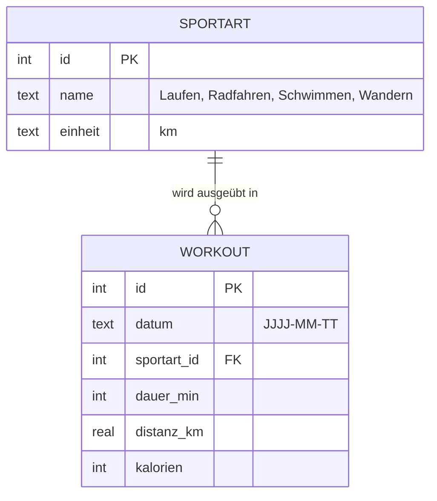

# FitTrack

Eine mobile-first Web-App, die persönliche Trainingsdaten auf dem Smartphone anzeigt.
Entwickelt im Kurs „Datenbasierte Fallstudien“ als agiles Projekt (Scrum im Kleinen) mit KI-Unterstützung im Chat.

**Product Vision:** FitTrack zeigt mir meine Trainingsdaten auf dem Smartphone – verständlich, aktuell, ansprechend.

| | |
|---|---|
| **Lernumgebung** | <https://swrobuts.github.io/FitTrack/> – elf Labs mit Prompts, Diagrammen, Konsole und SQLite im Browser |
| **Live-App** | <https://fittrack-k7gg.onrender.com> – die fertige Referenz auf Render |
| **Starter für Studierende** | Branch [`starter`](https://github.com/swrobuts/FitTrack/tree/starter) |

## Ordnerstruktur

```text
FitTrack/
├── backend/
│   ├── app/
│   │   ├── main.py            # FastAPI-Routen (entsteht in Sprint 1)
│   │   ├── models.py          # Pydantic-Datenmodell (Sprint 1)
│   │   ├── daten.py           # liest aus der SQLite-Datenbank (Sprint 1)
│   │   ├── statistik.py       # Kennzahlen berechnen (Sprint 1)
│   │   ├── chat.py            # Trainingsbot: Kontext, Werkzeugschleife, Anfrage an LM Studio (nur lokal)
│   │   ├── werkzeuge.py       # Werkzeugkatalog des Bots, dieselben Funktionen wie im MCP-Server
│   │   └── data/
│   │       ├── fittrack.db    # SQLite-Datenbank, 311 Trainingseinheiten, Sep 2024 – Sep 2026
│   │       └── schema.sql     # Tabellen sportart und workout, Sicht v_workout
│   └── tests/
│       ├── conftest.py        # baut die Testdatenbank aus schema.sql und dem Fixture
│       ├── fixtures/workouts_klein.sql    # 8 Einheiten, von Hand nachrechenbar
│       ├── test_api.py        # Tests ZUERST schreiben
│       └── test_mcp.py        # Werkzeuge des MCP-Servers gegen das Fixture
├── frontend/                  # index.html, style.css, app.js (Sprint 2)
├── scripts/generate_workouts.py   # erzeugt fittrack.db reproduzierbar
├── mcp/server.py              # MCP-Server: 14 Werkzeuge für Claude Desktop und LM Studio, rechnet mit statistik.py
├── docs/
│   ├── setup-webstorm.md      # IDE einrichten
│   └── checklisten.md         # Definition of Done, Review, End-Abnahme
├── requirements.txt
└── README.md
```

## Setup (einmalig)

Voraussetzungen: Python 3.12, Git, Docker Desktop, WebStorm mit Python-Plugin (oder PyCharm). Details in [docs/setup-webstorm.md](docs/setup-webstorm.md).

```bash
git clone <URL dieses Repos>
cd FitTrack
python3 -m venv .venv
source .venv/bin/activate        # Windows: .venv\Scripts\activate
pip install -r requirements.txt
```

## Tests ausführen

```bash
pytest
```

Zu Beginn ist der Test rot: `ModuleNotFoundError: No module named 'app.main'`. Das ist Absicht. Der Test beschreibt, was die App können soll, bevor es den Code gibt.

## App starten

```bash
uvicorn backend.app.main:app --reload --host 0.0.0.0 --port 8000
```

Dann im Browser: <http://localhost:8000/docs> zeigt die automatische API-Dokumentation.
Auf dem Smartphone im selben WLAN: `http://<IP-des-Rechners>:8000`.

## Datenmodell

Die Daten liegen in der SQLite-Datenbank `backend/app/data/fittrack.db`. SQLite braucht keinen Server: Die Datenbank ist eine Datei, und Python bringt das Modul `sqlite3` mit. Das Schema steht in `schema.sql`, die Datenbank wird daraus mit `python scripts/generate_workouts.py` erzeugt.



Die Sportart ist eine eigene Tabelle, damit ihr Name genau einmal gespeichert ist. Die Sicht `v_workout` verbindet beide Tabellen und liefert je Einheit den Namen der Sportart. Die API arbeitet nur mit dieser Sicht, deren Zeilen so aussehen:

| Feld | Typ | Beispiel |
|---|---|---|
| `id` | Zahl | 42 |
| `datum` | Text, `JJJJ-MM-TT` | `2026-05-14` |
| `sportart` | Text | `Laufen`, `Radfahren`, `Schwimmen`, `Wandern` |
| `dauer_min` | Zahl | 47 |
| `distanz_km` | Kommazahl | 8.3 |
| `kalorien` | Zahl | 512 |

## Product Backlog

### Sprint 1 – Daten und API

```text
US-1: Als Nutzer möchte ich alle meine Trainingseinheiten als JSON abrufen,
      damit die App sie anzeigen kann.
      Akzeptanz: GET /api/workouts liefert Status 200 und eine Liste;
      jedes Element enthält id, datum, sportart, dauer_min, distanz_km, kalorien.

US-2: Als Nutzer möchte ich meine Kennzahlen abrufen,
      damit ich meinen Fortschritt sehe.
      Akzeptanz: GET /api/stats liefert gesamt_km, durchschnitt_km_pro_woche,
      lieblingssportart, anzahl – korrekt berechnet für das Fixture.

US-3: Als Entwickler möchte ich einen Health-Endpunkt,
      damit ich später im Container prüfen kann, ob die App läuft.
      Akzeptanz: GET /health liefert {"status": "ok"}.
```

### Sprint 2 – Frontend

```text
US-4: Als Nutzer möchte ich die App auf dem Smartphone öffnen und ein
      übersichtliches Dashboard sehen, damit ich sie unterwegs nutzen kann.
      Akzeptanz: GET / liefert die Seite; bei 375 px Breite kein horizontales
      Scrollen; Karten stapeln sich; Touch-Targets mindestens 44 px.

US-5: Als Nutzer möchte ich meine Kennzahlen und die letzten Trainings sehen,
      damit ich meinen Stand auf einen Blick erfasse.
      Akzeptanz: Kennzahl-Karten und Liste werden per fetch aus /api/stats
      und /api/workouts gefüllt, nichts ist hartkodiert.

US-6: Als Nutzer möchte ich meinen Wochenverlauf als Balkendiagramm sehen
      und den Zeitraum wählen, damit ich Trends erkenne.
      Akzeptanz: GET /api/stats/wochen liefert pro Kalenderwoche distanz_km
      und anzahl, auch für Wochen ohne Training; das Diagramm zeigt diese
      Daten; Umschalter 8 W / 6 M / 1 J / Alles.

US-7: Als Nutzer möchte ich, dass jede Zahl und jede Grafik im Dashboard
      genau das aussagt, was die Daten hergeben, damit ich mich nicht
      auf ein schönes, aber falsches Bild verlasse.
      Akzeptanz: Das Wochenziel ist ein Bullet-Graph mit Zielmarke, eine
      Übererfüllung bleibt sichtbar; eine abgeschlossene Woche heißt
      Ergebnis, nicht Fortschritt; jede Achse und jede Farbe ist
      beschriftet; jede Grafik ist antippbar und nennt dann ihre Zahl;
      GET /api/stats/wochen liefert je Woche je_sportart; Schrift
      mindestens 13 px, Umschalter mit aria-pressed, helles und dunkles
      Thema. Siehe docs/checklisten.md, Abschnitt „Schön, aber falsch“.
```

### Sprint 3 – Docker und Abnahme

Dockerfile schreiben, Image bauen, Container starten, App auf dem Smartphone aus dem Container testen.

## Docker

Ein Container enthält App, Python und alle Bibliotheken. Was hier läuft, läuft identisch auf jedem Server.

```bash
docker build -t fittrack .              # Image bauen (Bauplan: Dockerfile)
docker run -p 8000:8000 fittrack        # Container starten -> http://localhost:8000
docker ps                               # laufende Container anzeigen
docker stop <CONTAINER ID>              # Container stoppen
```

Prüfen: <http://localhost:8000/health> antwortet mit `{"status": "ok"}`. Auf dem Smartphone im WLAN: `http://<IP-des-Rechners>:8000`.

Falls Port 8000 auf dem Rechner belegt ist: `docker run -p 8001:8000 fittrack` und dann Port 8001 im Browser nutzen.

Kürzer mit Docker Compose (Bauen und Starten in einem Befehl):

```bash
docker compose up --build            # http://localhost:8000
docker compose down                  # stoppen und aufräumen
```

Bei belegtem Port 8000: `FITTRACK_PORT=8001 docker compose up --build`.

## Deploy auf Render.com

Die Referenzlösung läuft unter <https://fittrack-k7gg.onrender.com>. Der Free-Plan schläft nach 15 Minuten ohne Zugriff ein, der erste Aufruf dauert dann bis zu einer Minute.

`render.yaml` beschreibt den Web Service. Render baut das Dockerfile aus dem GitHub-Repo und stellt die App unter einer öffentlichen HTTPS-Adresse bereit. Einrichtung: bei Render anmelden, `New → Blueprint`, Repo verbinden, `Apply`. Jeder Push auf `main` löst einen neuen Deploy aus.

## Tests bei jedem Push (GitHub Actions)

`.github/workflows/tests.yml` führt `pytest` bei jedem Push und Pull Request aus. Das Ergebnis steht im Reiter „Actions“ und als Haken oder Kreuz am Commit. Rote Tests fallen so auf, bevor jemand den Stand übernimmt.

## Trainingsbot und MCP-Server

Zwei Zugänge über die App hinaus, beide beschrieben in [docs/dozent/mcp.md](docs/dozent/mcp.md):

- **Trainingsbot in der App.** Ein Chat über Training und die eigenen Zahlen. Er läuft nur lokal: Die Route `POST /api/chat` schickt Kontext und den Werkzeugkatalog aus `werkzeuge.py` an ein Modell in LM Studio (`LMSTUDIO_URL`, Standard `http://localhost:1234/v1`), führt verlangte Aufrufe mit `statistik.py` aus und liefert Antwort samt Aufrufen zurück; das Sheet zeigt sie unter der Antwort. `GET /api/chat/status` meldet, ob ein Modell erreichbar ist; nur dann zeigt die Seite den Chat-Knopf, und die Option „Trainingsbot anzeigen“ im Seitenfuß kann ihn ausblenden. Auf Render gibt es kein LM Studio, dort bleibt der Bot aus.
- **MCP-Server** in `mcp/server.py`. Vierzehn Werkzeuge für Claude Desktop und LM Studio, geordnet nach Frageart: Orientierung (`gesundheit`, `heute`, `datenumfang`), Gesamtbild (`kennzahlen`, `sportarten`), Zeitscheiben (`woche`, `wochen`, `monate`, `zeitraum`, `vergleich`), Extreme und Muster (`bestwerte`, `pausen`, `wochentage`), Einzelfälle (`einheiten`). Was kein Werkzeug liefert, etwa Herzfrequenz oder Uhrzeit, beantwortet das Modell laut Anweisung mit „erfasst die App nicht“. Der Server holt die Einheiten von der App (`FITTRACK_URL`, Standard Render) und rechnet mit `statistik.py`, damit das Modell nichts selbst addieren muss. Abhängigkeiten in `mcp/requirements.txt`, nicht im Docker-Image.

## Wie die Kennzahlen definiert sind

- `gesamt_km`: Summe aller `distanz_km`, gerundet auf 1 Nachkommastelle.
- `durchschnitt_km_pro_woche`: `gesamt_km` geteilt durch die Anzahl der Kalenderwochen von der Woche des ersten bis zur Woche des letzten Trainings (beide inklusive), gerundet auf 1 Nachkommastelle.
- `lieblingssportart`: Sportart mit der größten Summe `distanz_km`. Bei Gleichstand die alphabetisch erste.
- `anzahl`: Anzahl der Einheiten.
- Leere Datenliste: 0.0, 0.0, `null`, 0.
- Zeitbezug: Jede Karte nennt ihren Zeitraum, im Kopf „Daten vom … bis …“, in Kennzahlen und Sportarten „seit Sep 2024“ (aus der ersten Kalenderwoche gerechnet), unter dem Verlauf der Zeitraum der gezeigten Balken mit Jahr, unter dem Kalender die Datumsspanne, unter „Letzte Aktivitäten“ die Spanne der gerade sichtbaren Einträge („6 von 311 Einheiten, 28.08. bis 05.09.2026“), die mit Aufklappen und Filter mitläuft.
- Kennzahl-Kacheln: Überschrift nennt den Bezug („Gesamt seit Sep 2024“, „Einheiten seit Sep 2024“), die Zeile unter der Zahl ordnet ein („in 311 Einheiten“, „Ziel in 33 von 105 Wochen“, „KW 37/2025 · 5 Einheiten“, „Ø 3,0 je Woche“). Tippen zeigt die Rechnung.
- `je_sportart` (pro Woche in `/api/stats/wochen`): Summe `distanz_km` je Sportart, gerundet auf 1 Nachkommastelle; Wochen ohne Training liefern `{}`.
- Wochenziel 40 km: einzige Konstante im Frontend (`WOCHENZIEL_KM` in `app.js`), gilt über alle Sportarten und steht so auch in der Wochenkarte. Dargestellt als Bullet-Graph: Balken für die Ist-Kilometer, Marke für das Ziel, Skala bis über das Ziel hinaus.
- Status-Badge: „Ziel erreicht“ ab 40 km; in der laufenden Woche „Auf Kurs“, wenn die Kilometer mindestens dem anteiligen Ziel nach verstrichenen Tagen entsprechen, sonst „Im Rückstand“; abgeschlossene Wochen unter 40 km: „Unter dem Ziel“. „n Wochen in Folge“ zählt zusammenhängende Wochen mit erreichtem Ziel.
- Trainingskalender und Sportarten-Kacheln rechnen im Browser aus `/api/workouts`: Kilometer je Tag, Kilometer, Anteil, Ø je Einheit und letzte Einheit je Sportart. Die Aktivitätenliste startet mit 10 Einträgen, auf dem Desktop mit 6, damit sie neben den Sportarten endet. „20 weitere anzeigen“ und „Alle anzeigen“ verlängern sie, „Wieder einklappen“ setzt sie auf den Start zurück und scrollt zur Karte.
- Schmale Displays: Alle Raster nutzen `minmax(0, 1fr)`, damit kein Kind die Seite breiter macht als den Bildschirm; unter 380 px (etwa das Frontdisplay eines Klapphandys) werden Abstände kleiner, die Zeitraumwahl hat zwei Reihen, die Sportarten-Kacheln eine Spalte. `viewport-fit=cover` plus `env(safe-area-inset-*)` hält Inhalte aus Kamera-Aussparung und runden Ecken.
- Jedes Objekt ist antippbar und öffnet ein Sheet (ein `<dialog>`, auf dem Handy von unten, auf dem Desktop mittig): Woche, Balken, Kalendertag, Kennzahl mit ihrer Rechnung, Sportart mit Filter, Einheit mit Tempo. Schließen per Knopf, Tippen daneben oder Escape.
- Thema: Der Knopf im Kopf schaltet hell und dunkel um; die Wahl liegt im `localStorage` unter `fittrack-thema`. Ohne Wahl gilt die Einstellung des Geräts. Die Farben stehen als `light-dark(hell, dunkel)` in `style.css`.

Rechnet die Erwartungswerte für das Fixture selbst aus, bevor ihr die KI nach Code fragt. Sonst prüft der Test nur, ob die KI mit sich selbst übereinstimmt.

## Lernumgebung FitTrack-Lab

Der Ordner `site/` enthält eine interaktive Lernumgebung zum Kurs: elf Labs entlang der Schritte, mit den Prompts zum Kopieren, Mermaid-Diagrammen, einer nachgebildeten Konsole für `git` und `docker`, SQLite im Browser mit dem Schema der App und 41 Übungen. Sie wird per GitHub Actions auf GitHub Pages veröffentlicht: <https://swrobuts.github.io/FitTrack/>. Lokal ansehen: `python3 -m http.server 8080 -d site` und <http://localhost:8080> öffnen.

## Für Dozierende

- `docs/dozent/prompt-skript.md`: alle Prompts in Schrittreihenfolge mit Prüfpunkten und Befehlen
- `docs/dozent/anleitung.html`: dieselben Inhalte als klickbare Anleitung zum lokalen Öffnen, mit Abhaken je Schritt und Kopierknopf an jedem Prompt und Befehl; erzeugt aus den Markdown-Dateien mit `scripts/baue_anleitung.py`
- `docs/dozent/erwartungswerte.md`: Handrechnung für das Fixture
- `docs/dozent/tests.md`: die 15 Tests des Bauwegs, die neun Tests des Trainingsbots und die 22 Tests des MCP-Servers, ihr Aufbau, Ausführung und typische Fehlerbilder
- `docs/dozent/mcp.md`: MCP-Server für Claude Desktop und LM Studio, Trainingsbot in der App
- `docs/dozent/render-deploy.md` und `docs/dozent/lmstudio-demo.md`
- `docs/dozent/2026-09-10-fittrack-design.md`: Design der Referenzlösung, fortgeschrieben bis US-7; `docs/dozent/archiv/`: der ursprüngliche Plan
- `docs/kurs/`: das Kurskonzept, auf den Stand der Referenzlösung fortgeschrieben
- Branch `starter` ist der Ausgangsstand für Studierende. Jeder Schritt ist ein Tag: `sprint-0`, `us-3`, `us-1`, `us-2`, `us-4`, `us-5`, `us-6`, `us-7`, `docker`, `render`, `ci`. Anzeigen mit `git checkout <tag>`, zurück mit `git checkout main`.
